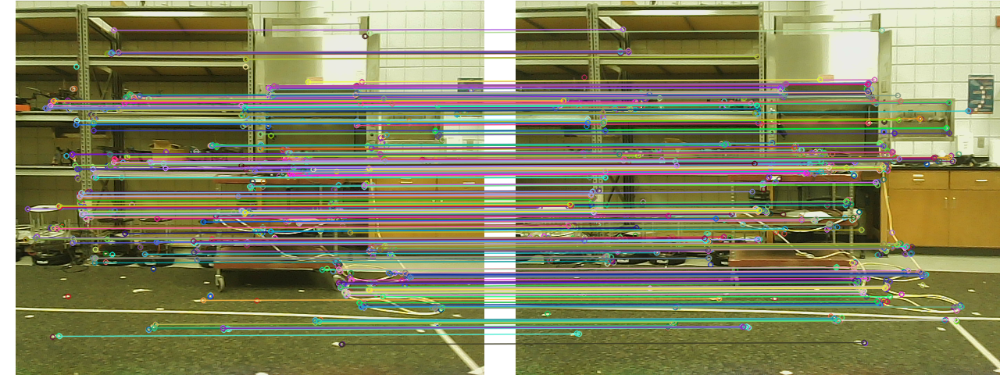

# uncc_rgbd_odom
This was originally forked from the UNCC Vision lab's original [repo](https://github.com/uncc-visionlab/uncc_rgbd_odom). This repo has just created a few extra launch files to make it easier to work with different sensors.
What follows is not the official documentation for the node.

## Prerequisites
ROS Kinetic
OpenCV

## Installation
```html
cd catkin_ws/src
git clone http://192.168.1.101/AVL-Summer-18/uncc_rgbd_odom
cd .. && catkin_make
```

## Sensors
We have tested the node with the [ASUS Xtion](https://www.asus.com/3D-Sensor/Xtion_PRO/), the [Orbecc Astra Pro](https://orbbec3d.com/product-astra-pro/) and the [Orbecc Astra](https://orbbec3d.com/product-astra)
Use the [rgbd_odometry.launch](./launch/rgbd_odometry.launch) for the xtion and the [astra_pro.launch](./launch/astra_rgbd.launch) for the Orbbec Astra Pro. When you want to use the Orbbec Astra, go to the [rgbd_odometry.launch](./launch/rgbd_odometry.launch) and toggle the 
```html
<arg name="sensor_type_astra" default="true" />
<arg name="sensor_type_xtion" default="false" />
```
If you have a bag file with the images, it is recommended you use the [odom_only.launch](./launch/odom_only.launch).
## High Level Overview
There is a ROS wrapper for the algorithm in the [src](./src/rgbd_odometry_ros.cpp) directory which subscribes to:
- depth_registered/input_image [sensor_msgs/Image]
- rgb/input_image [sensor_msgs/Image]
- rgb/camera_info [sensor_msgs/CameraInfo]

If the node does not work as intended please make sure that you have remapped all the topics correctly. 

### Working
For a detailed working please refer to the [publication](https://arc.aiaa.org/doi/abs/10.2514/1.G004000). 

The algorithm takes a "reference image", extracts features and then takes another image extracts feature from the second images and compares them with the first image. With this it determines how much the camera has moved between the two frames and reports it along with a covariance. 



## Note
**Orbbec Astra Pro NOT EQUAL to Orbbec Astra** 

They require completely different drivers which can be found in our repo. 

## Citation
```html
Anderson, Michael L., Kevin M. Brink, and Andrew R. Willis. 
"Real-Time Visual Odometry Covariance Estimation for Unmanned Air Vehicle Navigation." 
Journal of Guidance, Control, and Dynamics (2019): 1-17.
```